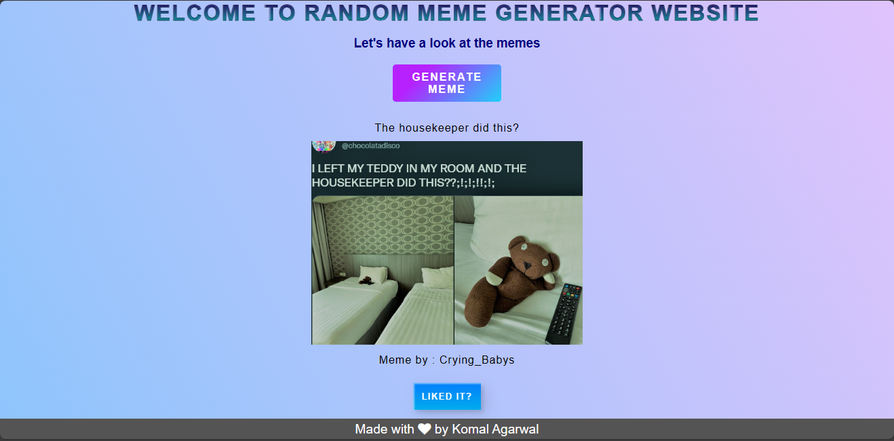

# Project Template - [komal-agarwal5_Random Meme Generator]

## Table of Contents

- [Overview](#overview)
- [Technologies Used](#technologies-used)
- [Features](#features)
- [Installation and Usage](#installation-and-usage)
- [Project Structure](#project-structure)
- [Screenshots or Demo](#screenshots-or-demo)
- [Contributing](#contributing)
- [License](#license)
- [Contact](#contact)

## Overview

- **Username**: komal-agarwal5
- **Project ID**: Random Meme Generator

It is a meme generator website.It generates random memes by using the technique of API Fetching.

## Technologies Used

- HTML
- CSS
- JS

## Features

- This is a random meme generator website.It generates random memes by using the technique of API Fetching.It is a good mini project for beginners who are learning JS.

## Installation and Usage

- Clone the repo ```git clone https://github.com/komal-agarwal5/opensource_guide.git``` or download the repository.
- Go to the cloned/downloaded directory ``` cd <folder_name> ```. 
- Run the index.html file 

For eg : If you are using VS Code click on Go live for index.html page

## Project Structure

- To get a meme click on the **Generate Meme** button
- This will display a meme every time you click on it

## Screenshots or Demo



## Contributing

1. **Fork the Repository**: Click the "Fork" button on the top right of this repository to create your copy on GitHub.

2. **Make Your Contribution**: Create a branch, make your changes, and ensure your code adheres to coding standards (if specified).

3. **Create a Pull Request**: Submit your changes by creating a pull request. Make sure to follow the [pull request template](../../docs/PULL_REQUEST_TEMPLATE.md).

4. **Collaborate and Communicate**: Engage in discussions and provide feedback on other contributions. Communication is key to successful collaboration.

Pull requests are welcome. For major changes, please open an issue first to discuss what you would like to change. 
Please make sure to update tests as appropriate.

## License

<a href="https://github.com/komal-agarwal5/opensource_guide/blob/komal/issue-%2315/projects/Komal%20Agarwal_Random%20Meme%20Generator/LICENSE">MIT LICENSE</a>

## Contact

- GitHub: [https://github.com/komal-agarwal5]
- Email: [komal.agarwal0709@gmail.com]
- LinkedIn: [https://www.linkedin.com/in/komal-agarwal-95a3a026a/]

## Support

💙 If you like this project, do give it a ⭐ and share it with your friends!<br><br>

---

Made with ❤️ by Komal Agarwal <br><br>