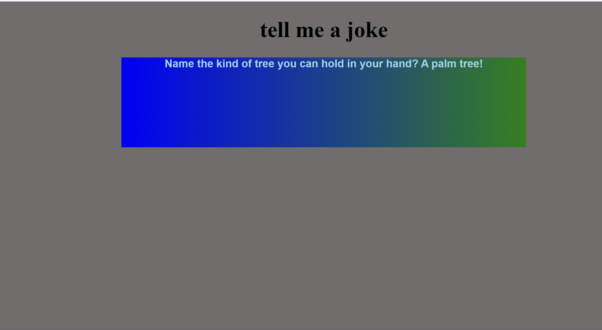

# Project Template - [ghost-2362003 joke generator]

## Table of Contents

- [Overview](#overview)
- [Technologies Used](#technologies-used)
- [Features](#features)
- [Installation and Usage](#installation-and-usage)
- [Project Structure](#project-structure)
- [Screenshots or Demo](#screenshots-or-demo)
- [Contributing](#contributing)
- [License](#license)
- [Contact](#contact)

## Overview

- **Username**: ghost-23602003
- **Project ID**: basic websites for jokes

Here is Hotstar Clone.👨🏻‍💻 I have made it using HTML,CSS & JS. It contains a static page with the basic features we often see in the HOTSTAR Page. 
## Technologies Used

- HTML
- CSS
- JS

## Features


## Installation and Usage

##   Fork the repo to your Github.<br/>

 - **Step 1:-**   Clone the Repo by going to your local Git Client in a particular local folder in your local machine by using this command with your forked repository link in place of below given link: <br/>
    ```bash
    git clone https://github.com/debarshee2004/opensource_guide.git
    ```

 - **Step 2:-**  Go inside  Directory.
    ```bash 
    cd .\projects\ghost-2362003_joke-generator
    ```

 - **Step 3:-** To run this project locally, go to live and it will open the website in the local host


- **Step 4:-**  Open browser and go to      [localhost:5000](http://localhost:5000/)   

   - *That's it Your Project setuped successfully for dev environment*

## Now you can Create Specific branch to work on this project ->
-   Create a branch using below command.
    ```bash
    git branch <your branch name>
    ```
-   Checkout to your branch.
    ```
    git checkout <your branch name>
    ```
-   Add your code in your local machine folder.
    ```
    git add .
    ```
-   Commit your changes.
    ```
    git commit -m"<add your message here>"
    ```
-   Push your changes.
    ```
    git push --set-upstream origin <your branch name>
    ```
-   Add your project name with the link in the readme in the desired format.
-   Make a pull request! (compare your branch with the owner main branch)

## Project Structure

there are 3 directories
- index.html
- script.js
- style.css
- readme.md

## Screenshots or Demo

 

## Contributing

 Create an issue of the project or a feature you would like to add in the project and get the task assigned for youself. (issue can be any feature or project that you think you could contribute to).

## License

MIT Lisence

## Contact

- GitHub: https://github.com/ghost-2362003
- Email: shubhojyotidas800@gmail.com
